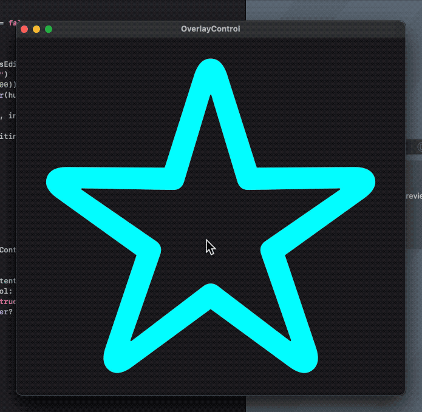

# OverlayControlSwiftUI

This project shows an implementation of appearing an overlaid control UI when a mouse pointer is on a specific area.

## Related Blog Post

- [SwiftUIでマウスホバー時にオーバレイ表示される操作UIを実装する](https://genjiapp.com/blog/2021/08/29/building-swiftui-overlay-control.html)